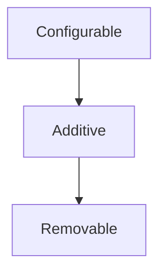
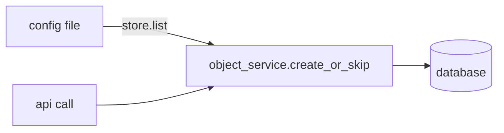

# ConfigStore Design

**Date:** 2026-06-25

## Problem

Configuration in the `nico` codebase is consumed inconsistently across several dimensions:

- Some values can be updated at runtime via API; others require a service restart, with no convention distinguishing them.
- API shapes for creating and removing objects vary across resource types.
- Some resources have two configuration mechanisms (config file and API), creating confusion about which is authoritative.
- Some objects can be safely removed; others cannot because other resources depend on them — but this is not structurally enforced anywhere.
- Config is read via a mix of direct Figment calls, `std::env::var`, and bespoke patterns — the lookup shape differs per crate.
- External services (e.g., the Go-based `rest-api`) must independently configure values that api-core already owns, leading to duplication and drift.

The goal is a single, typed read interface that all components use to access configuration, a  single creation path
for additive objects regardless of whether they originate from a config file or an API call, and enforcement
of which objects can be safely removed.

## Scope

**In scope:**
- `Configurable` trait — typed read interface for service config
- `Additive` trait — objects seeded from config and addable via API (route_servers, network_segments, resource_pools)
- `Removable` trait — additive objects that can be safely removed (no dependents — like route_servers)
- `FileConfigStore` — Figment-backed implementation (TOML + overlays + env vars)
- `GrpcConfigStore` — read-only Rust implementation backed by api-core's gRPC ConfigService
- gRPC `ConfigService` in api-core serving config to external clients (Go and Rust)
- `config-store` crate housing the traits, errors, and implementations
- Unified creation path for additive objects (same service-layer logic for file seeding and API calls)
- Service-layer `object_service::create_or_skip<T: Additive>` and `object_service::remove<T: Removable>` as the type-enforced mutation entry points

**Out of scope (deferred):**
- Write/update paths for service config — changes require a config file edit and restart
- File watching / hot reload
- In-memory runtime toggles (`DynamicSettings`) — managed separately via CLI utility
- `ConditionallyRemovable` — planned extension for objects removable only when dependents are cleared (see Future Work)
- `DatabaseConfigStore` — planned future implementation

## Two Categories of Configuration

### Category 1: Service Configuration

Behavioral parameters set at deployment time. Never modified via API. Changing them requires editing the config file and restarting the service. Examples: TLS certificate paths, listen address, database URL, DHCP servers, ASN, controller timing parameters.

- Source of truth: config file (TOML), with optional site overlay and env var overrides.
- Read by api-core at startup via `FileConfigStore`.
- Read by external services (e.g. `rest-api`) over gRPC from api-core after those services start.

### Category 2: Additive Objects

Entities with a logical "this object should exist" definition expressible in a config file and also creatable via API. They accumulate over time; deletion is rare at best (route servers), impossible at worst due to dependents (VPCs, NetworkSegments, ResourcePools).

- Config file and API are **symmetric**: both express "this object should exist" and both go through the same service-layer code path.
- Source provenance (config vs. API) is retained for display and audit only, not to change behavior.

## Config File Structure Convention

All configuration sections must be named TOML tables. Top-level flat keys (currently scattered at the document root in `carbide-apiconfig.toml`) move under a `[general]` section. Both the base config and any site overlay must use `[general]` for these fields.

Before:
```toml
listen = "[::]:1081"
database_url = "postgres://a:b@postgresql"
asn = 123

[tls]
identity_pemfile_path = "/path/to/cert"
```

After:
```toml
[general]
listen = "[::]:1081"
database_url = "postgres://a:b@postgresql"
asn = 123

[tls]
identity_pemfile_path = "/path/to/cert"
```

Site overlay files follow the same structure and are merged by Figment — site keys win, base keys not present in the site overlay are preserved.

## Trait Hierarchy



### `Configurable`

Implemented by any type representing a config section. `KEY` is the dotted TOML path (e.g. `"tls"`, `"general"`, `"auth.cli_certs"`). Field-level defaults are handled by serde's `#[serde(default)]` — the store is not involved.

```rust
pub trait Configurable: DeserializeOwned {
    const KEY: &'static str;
}
```

Types implementing only `Configurable` are **file-only** — the only way to change them is to edit the config file and restart.

### `Additive`

Extends `Configurable`. Implemented by types whose entries can also be created via API. `Item` is the singular type being added (e.g. `IpAddr` within `RouteServersConfig`). `Id` is the identity key used by `create_or_skip` to determine whether an item already exists.

```rust
pub trait Additive: Configurable {
    type Item;

    /// The identity key type for deduplication in create_or_skip.
    type Id: Eq + Hash;

    /// Extracts the identity key from an item.
    fn item_id(item: &Self::Item) -> Self::Id;

    /// Projects the config section into its individual items.
    /// Used by ConfigStore::list to avoid each store implementing
    /// its own extraction logic.
    fn items(self) -> Vec<Self::Item>;
}
```

With `items` on the trait, `ConfigStore::list` becomes a derived operation — every store implementation shares the same extraction:

```rust
async fn list<T: Additive>(&self) -> Result<Vec<T::Item>, ConfigError> {
    self.get::<T>().await.map(T::items)
}
```

Adding is always safe and has no preconditions. The config file and API both go through the same service-layer creation path at startup and at API call time respectively. Today this is implemented as bespoke per-resource functions (`create_initial_vpcs`, `reconcile_pool_defs`, `replace` for route servers, etc.). Part of the implementation work is converging these toward a consistent idempotent pattern.

Types implementing `Additive` but **not** `Removable` cannot be safely deleted — other resources depend on them.

The startup behavior differs by removability:
- **Removable** types: startup replaces the config-file-sourced entries in the database with whatever the current config declares. This is the "desired state = config file" model (route servers today).
- **Non-removable** types: startup runs `create_or_skip` — new entries are created; existing entries are left untouched. When an incoming item differs from the stored row, `create_or_skip` emits a `tracing::warn!` identifying the key and the mismatch (drift logging). The stored row is not modified.

### `Removable`

Extends `Additive`. Implemented by types whose entries can be safely removed with no side effects — they have no dependents. Removal is as routine as addition.

```rust
pub trait Removable: Additive {}
```

The type system enforces this: `object_service::remove::<T>()` does not compile unless `T: Removable`. There is no runtime guard needed.

Example: `RouteServersConfig` implements `Removable` because removing a route server has no effect on other resources.


## Resource Classification

| Resource | Traits | Startup behavior | Reasoning |
|---|---|---|---|
| `TlsConfig` | `Configurable` | N/A | File-only; restart to change |
| `GeneralConfig` | `Configurable` | N/A | File-only; restart to change |
| `SiteExplorerConfig` | `Configurable` | N/A | File-only; restart to change |
| `MachineStateControllerConfig` | `Configurable` | N/A | File-only; restart to change |
| `ResourcePoolsConfig` | `Additive` | `create_or_skip`; drift logged as `warn` | Removal unsafe; machines depend on pool addresses |
| `NetworksConfig` | `Additive` | `create_or_skip`; drift logged as `warn` | Removal unsafe; change is dangerous |
| `VpcDefinitions` | `Additive` | `create_or_skip`; drift logged as `warn` | Removal unsafe; other resources are scoped to a VPC |
| `NetworkSegmentsConfig` | `Additive` | `create_or_skip`; drift logged as `warn` | Removal unsafe; machines are assigned to segments |
| `RouteServersConfig` | `Additive + Removable` | Replace (desired state = config file) | No dependents; add/remove/replace freely |

## `ConfigStore`

`ConfigStore` is a concrete, cloneable value type — not a trait. It wraps an `Arc<dyn ConfigBackend>` where `ConfigBackend` is a private, object-safe trait with a single method. The typed `get<T>` and `list<T>` methods live on `ConfigStore` itself and do not appear in any trait, which keeps vtable dispatch simple and allows `ConfigStore` to be passed freely across threads and stored in `Arc` or `tokio::sync` primitives.

```rust
// Private — one vtable entry, no generics, object-safe.
#[async_trait]
trait ConfigBackend: Send + Sync {
    async fn get_raw(&self, key: &'static str) -> Result<serde_json::Value, ConfigError>;
}

// Public API.
#[derive(Clone)]
pub struct ConfigStore(Arc<dyn ConfigBackend>);

impl ConfigStore {
    // Category 1: service config reads.
    pub async fn get<T: Configurable>(&self) -> Result<T, ConfigError> {
        let raw = self.0.get_raw(T::KEY).await?;
        serde_json::from_value(raw)
            .map_err(|_| ConfigError::Deserialize { key: T::KEY })
    }

    // Returns T::default() on NotFound only. All other errors (Deserialize,
    // Io, Rpc) are logged as WARN and propagated — the default is intentionally
    // withheld on errors other than absence, so config typos and network
    // failures are never silently swallowed.
    pub async fn get_or_default<T: Configurable + Default>(&self) -> Result<T, ConfigError> {
        match self.get::<T>().await {
            Ok(v) => Ok(v),
            Err(ConfigError::NotFound { .. }) => Ok(T::default()),
            Err(e) => {
                tracing::warn!(key = T::KEY, "config fetch failed; using default only for NotFound");
                Err(e)
            }
        }
    }

    // Category 2: read the current set of additive objects.
    pub async fn list<T: Additive>(&self) -> Result<Vec<T::Item>, ConfigError> {
        self.get::<T>().await.map(T::items)
    }
}
```

Each store type implements `ConfigBackend` and exposes a constructor that produces a `ConfigStore`. Callers never hold the inner store type after construction.

`ConfigStore::get` is intended for startup reads and infrequent operational fetches. `#[async_trait]` desugars `get_raw` to a boxed future, adding one heap allocation per call. Services that need config values on every request should call `store.get()` once at startup, cache the result, and read the cached value per-request — not call `store.get()` in the hot path.

## `ConfigError`

```rust
#[derive(Debug, thiserror::Error)]
pub enum ConfigError {
    /// The section identified by `key` was absent from the store.
    #[error("config section '{key}' not found")]
    NotFound { key: &'static str },

    /// The section was present but could not be deserialized into the target type.
    #[error("failed to deserialize config section '{key}'")]
    Deserialize { key: &'static str },

    /// A file could not be read during FileConfigStore construction.
    #[error("failed to read config file '{path}': {source}")]
    Io { path: PathBuf, source: std::io::Error },

    /// A gRPC call failed during GrpcConfigStore::get.
    #[error("gRPC config fetch for '{key}' failed: {source}")]
    Rpc { key: &'static str, source: tonic::Status },
}
```

### Credential safety in error messages

`ConfigError` messages must not expose raw config values. Error messages include only structural metadata: the section key name (`key: &'static str`) and error category. They never embed field values such as database passwords, TLS key material, or token strings.

`ConfigError::Deserialize` carries only the section key — no source error and no raw value — because both `figment::Error` and `serde_json::Error` can include the value that failed to parse in their `Display` output. Dropping the source at the error boundary prevents credentials from leaking into logs. A unit test shall assert that constructing a `ConfigStore` from TOML containing a `database_url` with a password does not produce that password in any `ConfigError` display string.

`ConfigError::Io` includes `path` in its display, which is acceptable for ordinary config file paths (e.g. `/etc/carbide/config.toml`). If the future `figment_file_provider_adapter` feature is added and secret values are read from files under `/run/secrets/`, `Io` errors from those reads should redact the path to its directory component only (e.g. `/run/secrets/<redacted>`) to avoid exposing which secret is being read.

## `FileConfigStore`

All file I/O happens during construction; `get()` reads from in-memory state. The internal representation stores the merged configuration as an in-memory value (not a live `Figment` instance — `Figment` is `!Send`, so keeping it around would prevent `FileConfigStore` from being used across thread boundaries). `build()` runs the Figment merge and stores the result; after that the store is an owned value with no file-system dependency.

Figment handles layering: base TOML file → site overlay → env var overrides (later layers win).

**Env var constraint:** field names in `Configurable` types must not contain `__` (double underscore). That sequence is reserved as the section separator for env var overrides (e.g. `CARBIDE_API_TLS__CERT_PATH` → `[tls] cert_path`).

### Builder

`FileConfigStoreBuilder` is the builder type. All three builder methods (`builder`, `with_overlay`, `with_env_prefix`) are infallible — they record paths and settings without doing I/O. All file reads happen in `build()`, which is the single `Result`-returning boundary.

```rust
impl FileConfigStore {
    pub fn builder(base: impl AsRef<Path>) -> FileConfigStoreBuilder;
}

impl FileConfigStoreBuilder {
    /// Layer a site-specific TOML overlay. Later overlays take precedence.
    pub fn with_overlay(self, path: impl AsRef<Path>) -> Self;

    /// Layer environment variable overrides with the given prefix.
    /// Uses `__` as a section separator (e.g. `CARBIDE_API_TLS__CERT_PATH`).
    pub fn with_env_prefix(self, prefix: &str) -> Self;

    /// Reads all registered files, runs the Figment merge, stores the result
    /// in-memory, and wraps it in a ConfigStore. All file I/O happens here —
    /// missing or malformed files surface as ConfigError::Io.
    pub fn build(self) -> Result<ConfigStore, ConfigError>;
}
```

### `ConfigBackend` implementation

At `build()` time, Figment merges all layers and extracts the entire config as a single `serde_json::Value` map. `get_raw` then serves sub-sections directly from that map with no further I/O or Figment calls. This means there is one Figment-to-JSON deserialization pass at construction and a second `serde_json::from_value` pass in `ConfigStore::get<T>` — acceptable at startup frequency. TOML datetimes are the one type that does not round-trip cleanly through `serde_json::Value`; config fields should use strings for date/time values.

```rust
// Module-level helper so it can be unit tested independently.
// Keys may be dotted paths (e.g. "auth.cli_certs"). A plain
// serde_json::Map::get would do a literal string lookup and return None
// for any dotted key because JSON objects use flat string keys, not
// dotted paths. We traverse the nested structure instead.
pub(crate) fn get_nested<'a>(v: &'a serde_json::Value, key: &'static str) -> Option<&'a serde_json::Value> {
    key.split('.').try_fold(v, |node, part| node.get(part))
}

#[async_trait]
impl ConfigBackend for FileConfigStoreInner {
    async fn get_raw(&self, key: &'static str) -> Result<serde_json::Value, ConfigError> {
        get_nested(&self.data, key)
            .cloned()
            .ok_or(ConfigError::NotFound { key })
    }
}
```

### Test constructor

```rust
impl FileConfigStore {
    /// Accepts an inline TOML string instead of a file path. Performs the same
    /// Figment merge and JSON snapshot as build(). Does not support overlays or
    /// env var layers.
    #[cfg(any(test, feature = "test-utils"))]
    pub fn from_toml_str(s: &str) -> Result<ConfigStore, ConfigError>;

    /// Merges two inline TOML strings in the same order as
    /// builder().with_overlay(): base values first, then overlay on top.
    /// The overlay wins on any key present in both.
    #[cfg(any(test, feature = "test-utils"))]
    pub fn from_two_toml_strs(base: &str, overlay: &str) -> Result<ConfigStore, ConfigError>;
}
```

### Call site

```rust
let store: ConfigStore = FileConfigStore::builder("/etc/carbide/config.toml")
    .with_overlay("/etc/carbide/site.toml")
    .with_env_prefix("CARBIDE_API_")
    .build()?;

let tls: TlsConfig = store.get().await?;
let explorer: SiteExplorerConfig = store.get_or_default().await?;
let pools: Vec<PoolConfig> = store.list::<ResourcePoolsConfig>().await?;
```

## gRPC `ConfigService`

api-core exposes a `ConfigService`. External clients use it to fetch config values that cannot be read from a local file.

### When external services fetch config

External services (e.g. the Go `rest-api`) have two tiers:

1. **Startup config** — values required before the service can connect to anything (database, Temporal, TLS, listen port). Read from the service's own local config file at process start.
2. **Operational config** — values that can be fetched after the service is running (JWT issuers, auth parameters, rate limiter settings, site-level parameters). Fetched from api-core's `ConfigService` over gRPC.

### Proto design

The service has two surfaces:

**Typed RPCs for external services (Go `rest-api`, etc.)** — one RPC per `Configurable` type that needs to be fetched remotely. These are the cross-language contract; Go uses generated stubs directly and the Rust `ConfigStore` abstraction is not involved.

```proto
service ConfigService {
    rpc GetIssuersConfig(GetIssuersConfigRequest) returns (IssuersConfig);
    rpc GetAuthConfig(GetAuthConfigRequest) returns (AuthConfig);
    rpc GetRateLimiterConfig(GetRateLimiterConfigRequest) returns (RateLimiterConfig);
    // One typed RPC per Configurable type that external services need.
}
```

**Generic RPC for `GrpcConfigStore`** — a single `GetRawSection` RPC that accepts a section key and returns the section as JSON. `GrpcConfigStoreInner::get_raw` calls this one RPC for all types; the string key is the `Configurable::KEY` of the requested type. This avoids a `match key { ... }` dispatch in the client and means adding a new remotely-fetchable type requires no changes to `GrpcConfigStoreInner`.

```proto
message GetRawSectionRequest { string key = 1; }
message GetRawSectionResponse { string json = 1; }

// extend ConfigService:
rpc GetRawSection(GetRawSectionRequest) returns (GetRawSectionResponse);
```

**GetRawSection authorization.** Because `GetRawSection` accepts an arbitrary key string, it requires a server-side allowlist to prevent callers from requesting sections that were never intended to be remotely accessible (e.g. `database_url`, `tls`, internal ASN values). api-core defines a `const REMOTE_SECTION_ALLOWLIST: &[&str]` array alongside the `ConfigService` implementation, listing the `Configurable::KEY` values of types explicitly intended for remote access. The server hashes this into a `HashSet` at startup and returns `NOT_FOUND` for any key not in the list. Adding a new remotely-accessible type requires adding its `KEY` to `REMOTE_SECTION_ALLOWLIST` — a one-line, reviewable change. The typed RPCs are unaffected — they expose only the types they were written for by construction.

```rust
// In api-core alongside the ConfigService implementation.
// This is the authoritative, reviewable list of what GetRawSection exposes.
const REMOTE_SECTION_ALLOWLIST: &[&str] = &[
    IssuersConfig::KEY,       // "issuers"
    AuthConfig::KEY,          // "auth"
    RateLimiterConfig::KEY,   // "rate_limiter"
];
```

**Schema compatibility.** `GetRawSection` returns JSON with no schema version tag. If api-core renames or restructures a config section, any deployed `GrpcConfigStore` client targeting that section will receive a successful RPC response that fails deserialization as `ConfigError::Deserialize`. There is no backward-compatibility guarantee on the JSON shape emitted by `GetRawSection`. `GrpcConfigStore` clients must be updated and redeployed alongside api-core when the config schema changes. This is acceptable when api-core and its Rust service consumers share the same deployment lifecycle.

api-core serves both surfaces from its in-memory config store. Request messages for typed RPCs are empty (or carry a version field for future cache validation).

## `GrpcConfigStore`

A `ConfigStore` backed by api-core's `ConfigService` gRPC endpoint. Intended for future Rust services deployed separately from api-core that need operational config at runtime without a local config file.

### Constructor

```rust
impl GrpcConfigStore {
    pub async fn connect(endpoint: Uri) -> Result<ConfigStore, ConfigError>;
}
```

### `ConfigBackend` implementation

`get_raw` calls the generic `GetRawSection` RPC with the section key and deserializes the JSON response. All types route through the same RPC — adding a new remotely-fetchable `Configurable` type requires no changes to `GrpcConfigStoreInner`.

```rust
#[async_trait]
impl ConfigBackend for GrpcConfigStoreInner {
    async fn get_raw(&self, key: &'static str) -> Result<serde_json::Value, ConfigError> {
        let resp = self.client
            .get_raw_section(GetRawSectionRequest { key: key.to_owned() })
            .await
            .map_err(|s| ConfigError::Rpc { key, source: s })?;
        serde_json::from_str(&resp.into_inner().json)
            .map_err(|_| ConfigError::Deserialize { key })
    }
}
```

## Additive Object Unified Creation Path

At startup, api-core reads additive object definitions from `FileConfigStore` and feeds them through the same service-layer `create_or_skip()` logic used by API calls:



Both paths: same validation, same idempotency, same behavior. Today the seeding functions are bespoke per resource (`create_initial_vpcs`, `reconcile_pool_defs`, etc.); the implementation will converge these into a consistent pattern. Source provenance is recorded in the database for display and audit.

### Source provenance

`create_or_skip` records where each entry came from via a `ConfigSource` argument:

```rust
pub enum ConfigSource { ConfigFile, Api }
```

Each additive object table has a `created_via TEXT NOT NULL CHECK (created_via IN ('config_file', 'api'))` column. `create_or_skip` sets this on insert and does not update it if the row already exists — the first creator wins. Provenance is surfaced for display and audit only and does not affect runtime behavior.

```rust
/// Inserts item if no row with the same identity key exists; returns Ok(()) without
/// modification if one does. The source is recorded on insert only.
pub async fn create_or_skip<T: Additive>(
    db: &PgPool,
    item: T::Item,
    source: ConfigSource,
) -> Result<(), ServiceError>;

/// Deletes the row identified by id. Only compiles when T: Removable.
pub async fn remove<T: Removable>(
    db: &PgPool,
    id: T::Id,
) -> Result<(), ServiceError>;
```

`create_or_skip` semantics: the implementation uses `INSERT ... ON CONFLICT (id) DO NOTHING` rather than a select-then-insert pattern. This makes it safe under Postgres's default `READ COMMITTED` isolation level without requiring a serializable transaction — two concurrent callers for the same identity key both attempt the insert; one succeeds, the other is silently discarded by the database. The affected-rows count distinguishes insert (1) from skip (0) for logging and metrics. When affected-rows is 0 (skip), the implementation fetches the existing row to compare against the incoming item and emits a `tracing::warn!` if they differ; the stored row is not modified. The extra query is a startup-only cost and is not incurred on the insert path. This replaces the per-resource snapshot+warn behavior of functions like `reconcile_pool_defs`. The identity key for each additive type is defined by its `Additive::Id` impl (e.g., pool name for `ResourcePoolsConfig`, IP address for `RouteServersConfig`). This guarantee makes the seeding pass idempotent — running it twice against the same database produces the same state as running it once.

### Replace transaction semantics (Removable types)

`Removable` types use a **config-file-wins** model: the config file is the complete desired state, and the database is brought into sync on every startup. The replace operation runs in a single serializable transaction: delete all existing rows for the type (both `config_file` and `api` sourced), then insert the current config-file set. An empty config-file section results in an empty table — this is intentional.

The practical consequence is that API-added entries (e.g. a route server added via `nico-admin-cli`) are ephemeral: they survive until the next api-core restart, after which only the entries declared in the config file remain. Operators who want an API-added entry to persist across restarts must add it to the config file. This keeps the config file as the single authoritative source for `Removable` types and avoids a class of "where did this entry come from?" operational confusion.

The transaction serializes against concurrent `object_service::remove` and `object_service::create_or_skip` calls on the same type.

## Crate Structure

The crate targets the Rust 1.90.0 stable toolchain (pinned in `rust-toolchain.toml`) on Linux x86-64 and Linux aarch64; no nightly features are used.

```
crates/config-store/
├── Cargo.toml
└── src/
    ├── lib.rs              // public re-exports
    ├── configurable.rs     // Configurable trait
    ├── additive.rs         // Additive + Removable traits
    ├── store.rs            // ConfigStore struct + ConfigBackend private trait
    ├── error.rs            // ConfigError
    ├── file.rs             // FileConfigStore + FileConfigStoreBuilder
    └── grpc.rs             // GrpcConfigStore
```

Dependencies: `figment` (workspace, features = ["toml", "env"]), `serde_json` (workspace), `async-trait` (workspace), `thiserror` (workspace), `tonic` (workspace), `prost` (workspace).


## Consumer Example

```rust
// File-only: restart required to change TLS configuration.
#[derive(Deserialize)]
pub struct TlsConfig {
    pub identity_pemfile_path: PathBuf,
    pub identity_keyfile_path: PathBuf,
    pub root_cafile_path: PathBuf,
}
impl Configurable for TlsConfig { const KEY: &'static str = "tls"; }

// Additive, not Removable — pools cannot be removed (machines depend on their address
// ranges). Startup runs create_or_skip; drift against the stored row is logged as a
// warning by create_or_skip itself.
#[derive(Deserialize)]
pub struct ResourcePoolsConfig(pub HashMap<String, PoolConfig>);
impl Configurable for ResourcePoolsConfig { const KEY: &'static str = "pools"; }
impl Additive for ResourcePoolsConfig {
    type Item = (String, PoolConfig);
    type Id = String;
    fn item_id((name, _): &Self::Item) -> Self::Id { name.clone() }
    fn items(self) -> Vec<Self::Item> { self.0.into_iter().collect() }
}

// Additive, not Removable — network changes are dangerous; dependents would lose
// connectivity. Startup runs create_or_skip.
#[derive(Deserialize)]
pub struct NetworksConfig(pub HashMap<String, NetworkDef>);
impl Configurable for NetworksConfig { const KEY: &'static str = "networks"; }
impl Additive for NetworksConfig {
    type Item = (String, NetworkDef);
    type Id = String;
    fn item_id((name, _): &Self::Item) -> Self::Id { name.clone() }
    fn items(self) -> Vec<Self::Item> { self.0.into_iter().collect() }
}

// Additive + Removable — route servers have no dependents; startup replaces the
// config-file-sourced set in full so the database always reflects the current config.
#[derive(Deserialize)]
pub struct RouteServersConfig(pub Vec<IpAddr>);
impl Configurable for RouteServersConfig { const KEY: &'static str = "route_servers"; }
impl Additive for RouteServersConfig {
    type Item = IpAddr;
    type Id = IpAddr;
    fn item_id(addr: &Self::Item) -> Self::Id { *addr }
    fn items(self) -> Vec<Self::Item> { self.0 }
}
impl Removable for RouteServersConfig {}
```

## Testing Strategy

Follow the table-driven test style from `STYLE_GUIDE.md`. Add `carbide-test-support` as a dev-dependency and use `scenarios!` for fallible operations and `value_scenarios!` for total operations. Each error case becomes one labeled row rather than a separate `#[test]`.

**Unit tests in `config-store`** use a test constructor on `FileConfigStore` that accepts inline TOML — no files on disk. `from_toml_str` returns `Result<ConfigStore, ConfigError>`; the helper unwraps it with `.expect()` so test bodies work with a plain `ConfigStore`:

```rust
#[test]
fn get_nested_traverses_dotted_keys() {
    let v = serde_json::json!({"auth": {"cli_certs": {"path": "/certs"}}});
    assert!(get_nested(&v, "auth.cli_certs").is_some());
    assert!(get_nested(&v, "auth.missing").is_none());
    assert!(get_nested(&v, "auth.cli_certs.path").is_some());
}

fn store_from(toml: &str) -> ConfigStore {
    FileConfigStore::from_toml_str(toml)
        .expect("test TOML must be valid")
}

#[test]
async fn get_error_cases() {
    use carbide_test_support::{scenarios, Outcome::*};

    scenarios!(store.get::<TlsConfig>():
        "missing section" {
            store_from("[general]\nlisten = \"[::]:8080\"")
                => FailsWith(ConfigError::NotFound { key: "tls" }),
        }
        "malformed section" {
            store_from("[tls]\nnot_a_field = 99")
                => Fails,
        }
    );
}

#[test]
async fn overlay_wins_over_base() {
    let base    = "[tls]\nidentity_pemfile_path = \"/base/cert.pem\"\nidentity_keyfile_path = \"/base/key.pem\"\nroot_cafile_path = \"/base/ca.pem\"";
    let overlay = "[tls]\nidentity_pemfile_path = \"/site/cert.pem\"";
    let store = FileConfigStore::from_two_toml_strs(base, overlay)
        .expect("valid test TOML");
    let tls: TlsConfig = store.get().await.unwrap();
    assert_eq!(tls.identity_pemfile_path, PathBuf::from("/site/cert.pem"));
}
```

`compile_fail` doctests on `object_service::remove::<T>()` verify the type-system enforcement of `Removable`. See `STYLE_GUIDE.md` on `#[allow(dead_code)]` for the doctest carrier item.

**Integration tests per consumer crate** round-trip `Configurable` types against the real TOML fixture (`full_config.toml` + site overlay). These catch deserialization regressions when fields are added or renamed.

**`GrpcConfigStore` tests** use a mock `ConfigService` server started in-process. The mock enforces the allowlist. A test asserts that `store.get::<TlsConfig>()` (key `"tls"`, not in the allowlist) returns `ConfigError::Rpc` with a `NOT_FOUND` status rather than a deserialization error — confirming that access control is enforced before the section is fetched, not after.

**Additive object seeding tests** verify idempotency: running startup seeding twice produces the same DB state as running it once.

## Implementation Sequencing

Implement in this order to keep each phase independently testable:

1. **`FileConfigStore` + `get` / `list` + `get_nested` + unit tests** — the file store is entirely self-contained and is the only dependency of the seeding path. All unit tests described in the Testing Strategy section can be validated at this stage.
2. **`object_service::create_or_skip` + startup seeding refactor** — depends only on `FileConfigStore` and the existing DB layer. The full config-file → `store.list` → `create_or_skip` → DB flow can be exercised against a real store without any gRPC scaffolding.
3. **`object_service::remove` + `Removable` replace transaction** — builds on the same DB layer; no gRPC dependency.
4. **gRPC `ConfigService` + `GrpcConfigStore`** — add once a consuming service actually needs remote config. At that point `FileConfigStore` is stable, the contract is exercised, and the gRPC layer has a clear, tested interface to proxy.

## Future Work

- **`ConditionallyRemovable`** — for objects currently classified as `Additive` (e.g. `NetworkSegment`) that could become removable once their dependents are verified to be cleared. Would add a `verify_removable(&store) -> Result<(), RemovalBlockedError>` check that `object_service::remove()` calls before proceeding. `Removable` stays as "always safe, no check needed".
- **Drift operator tooling** — `create_or_skip` logs a warning when an incoming item differs from the existing row, but there is no structured operator workflow for acting on that signal. A `config_drift` table plus `nico-admin-cli config drift list/apply/reject` commands would let operators confirm or reject detected changes to non-removable objects without direct SQL access. Deferred until the need is established operationally. (This is the same concept that was present in earlier drafts as a `Reconcilable` trait; it has been simplified to a logging signal for now and deferred for structured tooling.)
- **File watching** — detect changes to mounted ConfigMap files and reload without a restart.
- **`DatabaseConfigStore`** — async-constructed store backed by a Postgres table; `get()` reads from an in-memory cache populated during construction.
- **Secret and sensitive value support** — Kubernetes secrets are typically mounted as files inside pods rather than inlined in TOML. The [`figment_file_provider_adapter`](https://crates.io/crates/figment_file_provider_adapter) crate wraps any Figment provider so that string values ending in a configurable suffix (e.g. `_file`) are replaced with the contents of the referenced file at construction time. Adding this as an optional layer in `FileConfigStoreBuilder` would let operators write `database_url_file = "/run/secrets/db-url"` in their TOML and have the store transparently load the secret, without exposing credentials in ConfigMaps.
