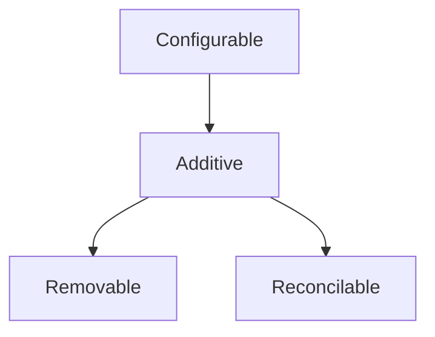
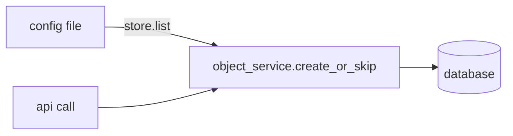

# ConfigStore Design

**Date:** 2026-06-25

## Problem

Configuration in the `nico` codebase is consumed inconsistently across several dimensions:

- Some values can be updated at runtime via API; others require a service restart, with no convention distinguishing them.
- API shapes for creating and removing objects vary across resource types.
- Some resources have two configuration mechanisms (config file and API), creating confusion about which is authoritative.
- Some objects can be safely removed; others cannot because other resources depend on them — but this is not structurally enforced anywhere.
- Config is read via a mix of direct Figment calls, `std::env::var`, and bespoke patterns — the lookup shape differs per crate.
- External services (e.g., the Go-based `rest-api`) must independently configure values that api-core already owns, leading to duplication and drift.

The goal is a single, typed read interface that all components use to access configuration, a  single creation path
for additive objects regardless of whether they originate from a config file or an API call, and enforcement
of which objects can be safely removed.

## Scope

**In scope:**
- `Configurable` trait — typed read interface for service config
- `Additive` trait — objects seeded from config and addable via API - (route_servers, network_segments,resource_pools)
- `Removable` trait — additive objects that can be safely removed (no dependents - like route_servers)
- `Reconcilable` trait — additive objects with explicit drift detection and operator-confirmed apply  (change to a resource_pool)
- `FileConfigStore` — Figment-backed implementation (TOML + overlays + env vars)
- `GrpcConfigStore` — Rust implementation backed by api-core's gRPC ConfigService
- gRPC `ConfigService` in api-core serving config to external clients (Go and Rust)
- `config-store` crate housing the traits, errors, and implementations
- Unified creation path for additive objects (same service-layer logic for file seeding and API calls)
- `config_drift` DB table and `nico-admin-cli config drift list/apply` CLI commands

**Out of scope (deferred):**
- Write/update paths for service config — changes require a config file edit and restart
- File watching / hot reload
- In-memory runtime toggles (`DynamicSettings`) — managed separately via CLI utility
- `ConditionallyRemovable` — planned extension for objects removable only when dependents are cleared (see Future Work)
- `DatabaseConfigStore` — planned future implementation

## Two Categories of Configuration

### Category 1: Service Configuration

Behavioral parameters set at deployment time. Never modified via API. Changing them requires editing the config file and restarting the service. Examples: TLS certificate paths, listen address, database URL, DHCP servers, ASN, controller timing parameters.

- Source of truth: config file (TOML), with optional site overlay and env var overrides.
- Read by api-core at startup via `FileConfigStore`.
- Read by external services (e.g. `rest-api`) over gRPC from api-core after those services start.

### Category 2: Additive Objects

Entities with a logical "this object should exist" definition expressible in a config file and also creatable via API. They accumulate over time; deletion is rare at best (route servers), impossible at worst due to dependents (VPCs, NetworkSegments, ResourcePools).

- Config file and API are **symmetric**: both express "this object should exist" and both go through the same service-layer code path.
- Source provenance (config vs. API) is retained for display and audit only, not to change behavior.

## Config File Structure Convention

All configuration sections must be named TOML tables. Top-level flat keys (currently scattered at the document root in `carbide-apiconfig.toml`) move under a `[general]` section. Both the base config and any site overlay must use `[general]` for these fields.

Before:
```toml
listen = "[::]:1081"
database_url = "postgres://a:b@postgresql"
asn = 123

[tls]
identity_pemfile_path = "/path/to/cert"
```

After:
```toml
[general]
listen = "[::]:1081"
database_url = "postgres://a:b@postgresql"
asn = 123

[tls]
identity_pemfile_path = "/path/to/cert"
```

Site overlay files follow the same structure and are merged by Figment — site keys win, base keys not present in the site overlay are preserved.

## Trait Hierarchy



### `Configurable`

Implemented by any type representing a config section. `KEY` is the dotted TOML path (e.g. `"tls"`, `"general"`, `"auth.cli_certs"`). Field-level defaults are handled by serde's `#[serde(default)]` — the store is not involved.

```rust
pub trait Configurable: DeserializeOwned {
    const KEY: &'static str;
}
```

Types implementing only `Configurable` are **file-only** — the only way to change them is to edit the config file and restart.

### `Additive`

Extends `Configurable`. Implemented by types whose entries can also be created via API. `Item` is the singular type being added (e.g. `RouteServer` within `RouteServersConfig`).

```rust
pub trait Additive: Configurable {
    type Item;
}
```

Adding is always safe and has no preconditions. The config file and API both go through the same service-layer creation path at startup and at API call time respectively. Today this is implemented as bespoke per-resource functions (`create_initial_vpcs`, `reconcile_pool_defs`, `replace` for route servers, etc.). Part of the implementation work is converging these toward a consistent idempotent pattern.

Types implementing `Additive` but **not** `Removable` cannot be safely deleted — other resources depend on them. Most of these also implement `Reconcilable` to handle config drift explicitly rather than silently.

### `Removable`

Extends `Additive`. Implemented by types whose entries can be safely removed with no side effects — they have no dependents. Removal is as routine as addition.

```rust
pub trait Removable: Additive {}
```

The type system enforces this: `store.remove::<T>()` does not compile unless `T: Removable`. There is no runtime guard needed.

Example: `RouteServersConfig` implements `Removable` because removing a route server has no effect on other resources.

### `Reconcilable`

Extends `Additive`. Implemented by types whose seeded definitions can drift from their config file declarations over time. Replaces the current silent-warn-and-ignore behavior in `reconcile_pool_defs` and `reconcile_network_defs` with observable, operator-controlled reconciliation.

```rust
pub enum ReconcileAction {
    AutoApply,            // safe to apply on startup without operator intervention
    RequireConfirmation,  // surface the drift visibly; don't apply until acknowledged
    Block,                // fail startup if drift is detected; too dangerous to ignore
}

pub trait Reconcilable: Additive {
    /// Defaults to `Block` — the safest behavior. Implementors that need
    /// `AutoApply` or `RequireConfirmation` override this explicitly.
    const DRIFT_ACTION: ReconcileAction = ReconcileAction::Block;

    /// Returns Some(description) if declared differs from stored, None if in sync.
    fn detect_drift(declared: &Self::Item, stored: &Self::Item) -> Option<String>;
}
```

When startup detects drift on a `RequireConfirmation` type, it emits a structured WARN log event before writing to `config_drift` and continues using the **stored** value — behavior is unchanged until the operator acts:

```rust
tracing::warn!(
    resource_type = T::KEY,
    name = %item_name,
    drift_description = %description,
    "config drift detected; pending operator confirmation"
);
```

When drift is detected on a `Block` type, a structured ERROR log event is emitted and startup fails immediately:

```rust
tracing::error!(
    resource_type = T::KEY,
    name = %item_name,
    stored_def = %serde_json::to_string(stored).unwrap_or_default(),
    declared_def = %serde_json::to_string(declared).unwrap_or_default(),
    "startup aborted: blocked config drift detected"
);
```

The `config_drift` table:

```sql
config_drift(
    resource_type TEXT,
    name          TEXT,
    stored_def    JSONB,
    declared_def  JSONB,
    detected_at   TIMESTAMPTZ,
    status        TEXT   -- 'pending' | 'applied' | 'rejected'
)
```

Operator action via admin-cli:

```
nico-admin-cli config drift list
  resource_pool "lo-ip"  prefix: 10.0.0.0/24 → 10.0.0.0/23  (pending since 2026-06-26)

nico-admin-cli config drift apply resource-pool lo-ip
  Applied. Pool definition updated; snapshot refreshed.

nico-admin-cli config drift reject resource-pool lo-ip
  Rejected. Stored definition retained; revert the config file to clear this entry.
```

All three subcommands operate without a TTY and are safe to invoke from scripts and automation pipelines. Exit code 0 indicates success; any non-zero exit code indicates failure (connection error, unknown resource, or invalid arguments). Output is human-readable plain text; structured JSON output is deferred to future work.

## Resource Classification

| Resource | Traits | Reasoning |
|---|---|---|
| `TlsConfig` | `Configurable` | File-only; restart to change |
| `GeneralConfig` | `Configurable` | File-only; restart to change |
| `SiteExplorerConfig` | `Configurable` | File-only; restart to change |
| `MachineStateControllerConfig` | `Configurable` | File-only; restart to change |
| `ResourcePoolsConfig` | `Additive + Reconcilable(RequireConfirmation)` | removal not safe; range changes need operator sign-off |
| `NetworksConfig` | `Additive + Reconcilable(Block)` | change is dangerous |
| `VpcDefinitions` | `Additive + Reconcilable(Block)` | changes require explicit operator resolution |
| `NetworkSegmentsConfig` | `Additive + Reconcilable(Block)` |change is dangerous |
| `RouteServersConfig` | `Additive + Removable + Reconcilable(AutoApply)` | No dependents; add/remove/update freely |

## `ConfigStore` Traits

`FileConfigStore` can read from a file but cannot persist runtime additions or removals — it has no backing store.
Putting `add()` and `remove()` on a single `ConfigStore` trait would force `FileConfigStore` to return a runtime error
for operations it structurally cannot support. Instead the read and write surfaces are split into two traits:

```rust
// Read interface — implemented by all stores including FileConfigStore
pub trait ConfigStore {
    // Category 1: service config reads
    async fn get<T: Configurable>(&self) -> Result<T, ConfigError>;

    async fn get_or_default<T: Configurable + Default>(&self) -> T {
        self.get::<T>().await.unwrap_or_default()
    }

    // Category 2: read the current set of additive objects
    async fn list<T: Additive>(&self) -> Result<Vec<T::Item>, ConfigError>;
}

// Write interface — implemented by stores with persistent backing (DB, gRPC)
pub trait MutableConfigStore: ConfigStore {
    async fn add<T: Additive>(&self, item: T::Item) -> Result<(), ConfigError>;
    async fn remove<T: Removable>(&self, item: T::Item) -> Result<(), ConfigError>;
}
```

`FileConfigStore` implements `ConfigStore` only — it provides the merged file view for reads and seeding, but runtime mutations go through a `MutableConfigStore`. `GrpcConfigStore` and the future `DatabaseConfigStore` implement `MutableConfigStore`.

`get_or_default` falls back to `T::default()` on **any** error, including deserialization failures. Callers that need to distinguish missing-vs-malformed should use `get` directly.

## `ConfigError`

```rust
#[derive(Debug, thiserror::Error)]
pub enum ConfigError {
    /// The section identified by `key` was absent from the store.
    #[error("config section '{key}' not found")]
    NotFound { key: &'static str },

    /// The section was present but could not be deserialized into the target type.
    #[error("failed to deserialize config section '{key}': {source}")]
    Deserialize { key: &'static str, source: figment::Error },

    /// A file could not be read during FileConfigStore construction.
    #[error("failed to read config file '{path}': {source}")]
    Io { path: PathBuf, source: std::io::Error },

    /// A gRPC call failed during GrpcConfigStore::get.
    #[error("gRPC config fetch for '{key}' failed: {source}")]
    Rpc { key: &'static str, source: tonic::Status },
}
```

### Credential safety in error messages

`ConfigError` messages must not expose raw config values. Error messages include only structural metadata: the section key name (`key: &'static str`) and error category. They never embed field values such as database passwords, TLS key material, or token strings.

The `Deserialize` variant wraps `figment::Error`. Figment's `Display` implementation can include the value that failed to deserialize. Before surfacing a `ConfigError::Deserialize` to logs or user-facing output, callers must use only the `key` field for context and discard the `figment::Error` display output in any log line that may be shipped externally. A unit test shall assert that constructing a `FileConfigStore` from TOML containing a `database_url` with a password does not produce that password in any `ConfigError` display string.

## `FileConfigStore`

Wraps a `Figment` instance. All file I/O happens during construction; `get()` reads from in-memory state. Figment handles layering: base TOML file → site overlay → env var overrides (later layers win).

### Builder

```rust
impl FileConfigStore {
    /// Reads and validates the base file eagerly so construction fails fast
    /// on a missing or malformed file.
    pub fn builder(base: impl AsRef<Path>) -> Result<FileConfigStoreBuilder, ConfigError>;
}

impl FileConfigStoreBuilder {
    /// Layer a site-specific TOML overlay. Later overlays take precedence.
    pub fn with_overlay(self, path: impl AsRef<Path>) -> Self;

    /// Layer environment variable overrides with the given prefix.
    /// Uses `__` as a section separator (e.g. `CARBIDE_API_TLS__CERT_PATH`).
    pub fn with_env_prefix(self, prefix: &str) -> Self;

    pub fn build(self) -> FileConfigStore;
}
```

### `ConfigStore` implementation

```rust
impl ConfigStore for FileConfigStore {
    async fn get<T: Configurable>(&self) -> Result<T, ConfigError> {
        self.figment.extract_inner(T::KEY).map_err(|e| {
            if e.missing() {
                ConfigError::NotFound { key: T::KEY }
            } else {
                ConfigError::Deserialize { key: T::KEY, source: e }
            }
        })
    }

    async fn list<T: Additive>(&self) -> Result<Vec<T::Item>, ConfigError> {
        // Extracts the collection at T::KEY and returns its items.
        // File store: reads the merged TOML section.
    }

}
// FileConfigStore implements ConfigStore only — add/remove are on MutableConfigStore,
// which FileConfigStore does not implement.
```

### Call site

```rust
let store = FileConfigStore::builder("/etc/carbide/config.toml")?
    .with_overlay("/etc/carbide/site.toml")
    .with_env_prefix("CARBIDE_API_")
    .build();

let tls: TlsConfig = store.get().await?;
let explorer: SiteExplorerConfig = store.get_or_default().await;
let pools: Vec<PoolConfig> = store.list::<ResourcePoolsConfig>().await?;
```

## gRPC `ConfigService`

api-core exposes a `ConfigService`. External clients use it to fetch config values that cannot be read from a local file.

### When external services fetch config

External services (e.g. the Go `rest-api`) have two tiers:

1. **Startup config** — values required before the service can connect to anything (database, Temporal, TLS, listen port). Read from the service's own local config file at process start.
2. **Operational config** — values that can be fetched after the service is running (JWT issuers, auth parameters, rate limiter settings, site-level parameters). Fetched from api-core's `ConfigService` over gRPC.

### Proto design

One proto message and one RPC per `Configurable` type exposed remotely.

```proto
service ConfigService {
    rpc GetIssuersConfig(GetIssuersConfigRequest) returns (IssuersConfig);
    rpc GetAuthConfig(GetAuthConfigRequest) returns (AuthConfig);
    rpc GetRateLimiterConfig(GetRateLimiterConfigRequest) returns (RateLimiterConfig);
    // One RPC per Configurable type that external services need.
}
```

Request messages are empty (or carry a version field for future cache validation). api-core serves responses directly from its in-memory `FileConfigStore`.

The Go `rest-api` uses generated Go gRPC stubs directly — the Rust `ConfigStore` trait is not involved. The proto definition is the cross-language contract.

## `GrpcConfigStore`

A Rust implementation of `ConfigStore` for future Rust services deployed separately from api-core.

### `GrpcConfigurable` trait

Each Rust type fetchable over gRPC implements `GrpcConfigurable`, which owns the RPC dispatch:

```rust
pub trait GrpcConfigurable: Configurable {
    async fn fetch_remote(
        client: &mut ConfigServiceClient<Channel>,
    ) -> Result<Self, ConfigError>;
}
```

### Store

```rust
impl ConfigStore for GrpcConfigStore {
    async fn get<T: GrpcConfigurable>(&self) -> Result<T, ConfigError> {
        T::fetch_remote(&mut self.client.clone()).await
    }
    // list: delegates to the gRPC service's List RPCs
}

impl MutableConfigStore for GrpcConfigStore {
    // add/remove: delegate to the gRPC service's Add/Remove RPCs
}
```

## Additive Object Unified Creation Path

At startup, api-core reads additive object definitions from `FileConfigStore` and feeds them through the same service-layer `create_or_skip()` logic used by API calls:



Both paths: same validation, same idempotency, same behavior. Today the seeding functions are bespoke per resource (`create_initial_vpcs`, `reconcile_pool_defs`, etc.); the implementation will converge these into a consistent pattern. Source provenance is recorded in the database for display and audit.

`create_or_skip` semantics: if an object with the same identity key already exists in the database, `create_or_skip` returns `Ok(())` without modifying the stored row. The identity key for each additive type is defined by its `Additive` impl (e.g., pool name for `ResourcePoolsConfig`, IP address for `RouteServersConfig`). This guarantee makes the seeding pass idempotent — running it twice against the same database produces the same state as running it once.

## Crate Structure

The crate targets the Rust 1.90.0 stable toolchain (pinned in `rust-toolchain.toml`) on Linux x86-64 and Linux aarch64; no nightly features are used.

```
crates/config-store/
├── Cargo.toml
└── src/
    ├── lib.rs              // public re-exports
    ├── configurable.rs     // Configurable trait
    ├── additive.rs         // Additive trait
    ├── removable.rs        // Removable trait
    ├── reconcilable.rs     // Reconcilable trait + ReconcileAction enum
    ├── store.rs            // ConfigStore + MutableConfigStore traits
    ├── error.rs            // ConfigError
    ├── file.rs             // FileConfigStore + FileConfigStoreBuilder
    └── grpc.rs             // GrpcConfigStore + GrpcConfigurable
```

Dependencies: `figment` (workspace, features = ["toml", "env"]), `thiserror` (workspace), `tonic` (workspace), `prost` (workspace).


## Consumer Example

```rust
#[derive(Deserialize)]
pub struct TlsConfig {
    pub identity_pemfile_path: PathBuf,
    pub identity_keyfile_path: PathBuf,
    pub root_cafile_path: PathBuf,
}
impl Configurable for TlsConfig { const KEY: &'static str = "tls"; }

// Additive + Reconcilable(RequireConfirmation) — pools cannot be removed (machines depend on them);
// range changes surface as operator-visible drift rather than being silently ignored.
#[derive(Deserialize)]
pub struct ResourcePoolsConfig(pub HashMap<String, PoolConfig>);
impl Configurable for ResourcePoolsConfig { const KEY: &'static str = "pools"; }
impl Additive for ResourcePoolsConfig { type Item = (String, PoolConfig); }
impl Reconcilable for ResourcePoolsConfig {
    const DRIFT_ACTION: ReconcileAction = ReconcileAction::RequireConfirmation;
    fn detect_drift(declared: &Self::Item, stored: &Self::Item) -> Option<String> { /* ... */ }
}

// Additive + Reconcilable(Block, default) — network changes are dangerous; DRIFT_ACTION
// is omitted because Block is the trait default.
#[derive(Deserialize)]
pub struct NetworksConfig(pub HashMap<String, NetworkDef>);
impl Configurable for NetworksConfig { const KEY: &'static str = "networks"; }
impl Additive for NetworksConfig { type Item = (String, NetworkDef); }
impl Reconcilable for NetworksConfig {
    fn detect_drift(declared: &Self::Item, stored: &Self::Item) -> Option<String> { /* ... */ }
}

// Additive + Removable + Reconcilable(AutoApply) — route servers have no dependents;
// definition changes are safe to apply immediately on startup.
#[derive(Deserialize)]
pub struct RouteServersConfig(pub Vec<IpAddr>);
impl Configurable for RouteServersConfig { const KEY: &'static str = "route_servers"; }
impl Additive for RouteServersConfig { type Item = IpAddr; }
impl Removable for RouteServersConfig {}
impl Reconcilable for RouteServersConfig {
    const DRIFT_ACTION: ReconcileAction = ReconcileAction::AutoApply;
    fn detect_drift(declared: &Self::Item, stored: &Self::Item) -> Option<String> { /* ... */ }
}
```

## Testing Strategy

Follow the table-driven test style from `STYLE_GUIDE.md`. Add `carbide-test-support` as a dev-dependency and use `scenarios!` for fallible operations and `value_scenarios!` for total operations. Each error case becomes one labeled row rather than a separate `#[test]`.

**Unit tests in `config-store`** use inline TOML via `Figment::new().merge(Toml::string(s))` — no files on disk:

```rust
fn store_from(toml: &str) -> FileConfigStore {
    FileConfigStore { figment: Figment::new().merge(Toml::string(toml)) }
}

#[test]
async fn get_error_cases() {
    use carbide_test_support::{scenarios, Outcome::*};

    scenarios!(store.get::<TlsConfig>():
        "missing section" {
            store_from("[general]\nlisten = \"[::]:8080\"")
                => FailsWith(ConfigError::NotFound { key: "tls" }),
        }
        "malformed section" {
            store_from("[tls]\nnot_a_field = 99")
                => Fails,
        }
    );
}

#[test]
async fn overlay_wins_over_base() {
    // Two inline TOML layers; assert the overlay value takes precedence.
}
```

`compile_fail` doctests on `store.remove::<T>()` verify the type-system enforcement of `Removable`. See `STYLE_GUIDE.md` on `#[allow(dead_code)]` for the doctest carrier item.

**Integration tests per consumer crate** round-trip `Configurable` types against the real TOML fixture (`full_config.toml` + site overlay). These catch deserialization regressions when fields are added or renamed.

**`GrpcConfigStore` tests** use a mock `ConfigService` server started in-process.

**Additive object seeding tests** verify idempotency: running startup seeding twice produces the same DB state as running it once.

## Future Work

- **`ConditionallyRemovable`** — for objects currently classified as `Additive` (e.g. `NetworkSegment`) that could become removable once their dependents are verified to be cleared. Would add a `verify_removable(store) -> Result<(), RemovalBlockedError>` check that `ConfigStore::remove()` calls before proceeding. `Removable` stays as "always safe, no check needed".
- **File watching** — detect changes to mounted ConfigMap files and reload without a restart.
- **`DatabaseConfigStore`** — async-constructed store backed by a Postgres table; `get()` reads from an in-memory cache populated during construction.
- **Secret and sensitive value support** — Kubernetes secrets are typically mounted as files inside pods rather than inlined in TOML. The [`figment_file_provider_adapter`](https://crates.io/crates/figment_file_provider_adapter) crate wraps any Figment provider so that string values ending in a configurable suffix (e.g. `_file`) are replaced with the contents of the referenced file at construction time. Adding this as an optional layer in `FileConfigStoreBuilder` would let operators write `database_url_file = "/run/secrets/db-url"` in their TOML and have the store transparently load the secret, without exposing credentials in ConfigMaps.
