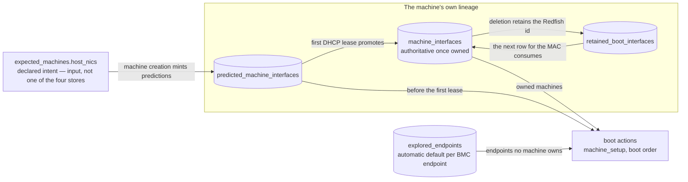

# Boot Interfaces and DPU Modes

This guide explains how NICo decides **which interface a host boots from**, how a host's **DPUs are managed**, and how operators configure both through the Expected Machines table. It is the deep companion to [Ingesting Hosts](ingesting-hosts.md), which covers the end-to-end ingest flow and the basic `expected_machines.json`; this page covers the per-host and per-NIC knobs (`dpu_mode`, `host_nics`), **what the defaults do when you set nothing**, and how a boot device is chosen and applied behind the scenes.

For the DHCP and network-segment substrate these knobs sit on (how a relay's `giaddr` maps to a segment), see [IP and Network Configuration](ip-and-network-configuration.md).

> **Who should read this.** Operators configuring hosts for ingestion, and anyone debugging "why did this host boot from *that* interface?" **Most hosts need no configuration here** — the defaults handle the common managed-DPU case. Reach for the knobs in [Section 2](#2-configuring-via-expected-machines-and-the-defaults) and [Section 3](#3-scenarios) only for NIC-mode, zero-DPU, or integrated-NIC hosts. [Sections 6](#6-behind-the-scenes-how-a-boot-device-is-chosen-and-set)–[7](#7-the-boot-interface-data-model) explain the machinery when you need to trace a problem.

---

## 1. The mental model: two independent axes

Historically, two separate decisions were conflated into "what kind of host is this." Keep them apart:

| Axis | Question | Controlled by |
|---|---|---|
| **DPU management** | Does NICo manage this host's DPUs (upgrade them, run agents, serve the host's admin network over the DPU overlay)? | `dpu_mode` |
| **Boot interface** | Which NIC does the host OS boot from and run its management network on? | the host's **primary** interface |

A "normal" host couples them (a managed DPU it also boots through). But they are independent: you can keep a host's DPUs **managed** and still boot it from a plain **integrated NIC**. This guide treats the two axes separately, because the configuration knobs are separate.

### Network segment types

A host's management network lives on one of a few segment types. Which one depends on **how the host boots**:

| Segment type | What it is | Used when |
|---|---|---|
| **Admin** | A **DPU-served overlay**. A DPU in DPU mode runs an on-board DHCP server and hands the host OS its admin IP over the overlay; the physical fabric never sees it (the DPU is a VTEP). | The host boots **through a DPU**. |
| **HostInband** | An ordinary NIC straight to the physical fabric. The host gets its IP from central NICo DHCP (`nico-dhcp`), and the switch port is configured differently. This is also the segment Flat-VPC allocation keys off. | The host boots through a **plain NIC** — an integrated NIC, or a DPU in NIC mode. |
| **Underlay** | The DPU's *own* IP (its loopback/VTEP) and the OOB/BMC management network. | Always, for DPU self-addressing and BMCs. |
| **Tenant** | Tenant workload networks. | After a host is assigned to a tenant. |

**Rule of thumb:** the host-OS segment follows the boot interface's mode — boot via DPU ⇒ **Admin**; boot via a plain NIC ⇒ **HostInband**. A non-DPU NIC is never on the Admin segment, because Admin *is* the DPU overlay.

### The boot (primary) interface

In NICo the **boot interface and the primary interface are the same thing by construction**: a host's `primary` interface is the one its boot order targets. A boot interface is a `(MAC, Redfish interface id)` pair — the MAC identifies the NIC on the wire; the Redfish id lets NICo set the boot order on the BMC. NICo refers to this pair as the host's `MachineBootInterface`.

NICo keeps both halves because the MAC alone can go stale: a NIC can drop out of the BMC's Redfish inventory (taking its MAC with it) while the interface id remains addressable. When NICo targets a boot operation at the BMC, it tries the MAC first and, when it knows the full pair, retries with the interface id on any error — so boot configuration keeps working when the MAC has vanished from the inventory, as happens after a DPU-to-NIC-mode flip or when a NIC de-enumerates across a reboot.

---

## 2. Configuring via Expected Machines and the defaults

Boot and DPU configuration is **declarative**: you describe the host in the Expected Machines table, and site-explorer + the machine-controller make it so during ingestion. For the table's basics (schema, `replace-all` upload, credentials), see [Ingesting Hosts → Add Expected Machines](ingesting-hosts.md#add-expected-machines-table). This section covers only the boot/DPU fields.

### If you set nothing (the default)

**Most hosts need zero boot/DPU configuration.** With no `dpu_mode` and no `host_nics`:

- `dpu_mode` defaults to **`dpu_mode`** (managed) — NICo ingests and manages the host's DPUs, and the host boots through its primary DPU on the **Admin** network.
- Site-explorer **auto-selects the boot interface**: the lowest-PCI DPU host-PF (the NIC a DPU presents to the host).
- The host's IP comes from whichever segment its DHCP relay lands in (see [IP and Network Configuration](ip-and-network-configuration.md)).

So a standard DPU host is handled entirely by defaults; the knobs below exist for the exceptions.

### `dpu_mode`

| Value (JSON / CLI) | Meaning |
|---|---|
| `dpu_mode` / `dpu-mode` (default) | DPUs are managed by NICo; the host boots through its primary DPU on the Admin overlay. |
| `nic_mode` / `nic-mode` | DPU hardware is present but treated as a **plain NIC**. Site-explorer explores it but does **not** link or manage it; the host boots on **HostInband**. |
| `no_dpu` / `no-dpu` | No DPU hardware at all — a plain host NIC on **HostInband**. DPU exploration is skipped entirely. |

**Resolution order:** a per-host `dpu_mode` on the Expected Machine wins; if unset, the site-wide `[site_explorer] dpu_mode` setting applies; if it too is unset, the default is `dpu_mode`.

### `host_nics` (per-NIC declaration)

The optional `host_nics` array declares specifics for individual host NICs. Each entry (`ExpectedHostNic`):

| Field | Type | Purpose | Default if unset |
|---|---|---|---|
| `mac_address` | string (required) | The NIC's MAC address. | — |
| `primary` | bool | Declare **this NIC** as the host's boot/primary interface. **At most one per host.** | Site-explorer auto-picks (lowest-PCI DPU host-PF). |
| `network_segment_type` | enum: `admin` / `underlay` / `host_inband` / `tenant` | The segment type this NIC's first DHCP lease should come from. Only needed to **disambiguate** when the NIC's DHCP relay matches more than one segment (nested/overlapping prefixes — see note below); otherwise the relay decides. | The relay's matching segment(s) stand. |
| `fixed_ip` / `fixed_mask` / `fixed_gateway` | string | Static IP assignment for the NIC, pre-allocated at upload time. | Dynamic allocation. |
| `nic_type` | string (legacy) | A free-form segment hint, **superseded by `network_segment_type`**. Kept for backward compatibility only. | — |

> **What `network_segment_type` does.** A NIC's segment is normally determined by its DHCP relay: NICo picks the segment whose prefix *contains* the relay address. Where segment prefixes **nest or overlap** — for example a `/27` HostInband segment inside a `/24` underlay — one relay matches several segments. `network_segment_type` narrows the match to the segment of the named type. If a relay maps unambiguously to one segment (the common case), this field is unnecessary.

**JSON** (an Expected Machine entry):

```json
{
  "bmc_mac_address": "C4:5A:B1:C8:38:0D",
  "bmc_username": "root",
  "bmc_password": "default-password1",
  "chassis_serial_number": "SERIAL-1",
  "dpu_mode": "dpu_mode",
  "host_nics": [
    {
      "mac_address": "C4:5A:B1:C8:38:10",
      "primary": true,
      "network_segment_type": "host_inband"
    }
  ]
}
```

**CLI** (single host):

```bash
nico-admin-cli -a <api-url> em add \
  --bmc-mac-address C4:5A:B1:C8:38:0D \
  --bmc-username root --bmc-password default-password1 \
  --chassis-serial-number SERIAL-1 \
  --dpu-mode dpu-mode \
  --host_nics '[{"mac_address":"C4:5A:B1:C8:38:10","primary":true,"network_segment_type":"host_inband"}]'
```

(`em` is the alias for `expected-machine`.)

---

## 3. Scenarios

Concrete recipes for the cases beyond the default. All assume the rest of the Expected Machine entry (BMC credentials, serial) is filled in as usual.

### 3.1 Standard DPU host

Nothing to configure. Managed DPUs, boot through the primary DPU on Admin. This is the default.

### 3.2 Zero-DPU host (no DPU hardware)

A plain server with one or more host NICs and no DPU. Declare `no_dpu` and mark the boot NIC primary:

```json
{
  "dpu_mode": "no_dpu",
  "host_nics": [
    { "mac_address": "AA:BB:CC:00:00:10", "primary": true, "network_segment_type": "host_inband" }
  ]
}
```

The host boots from the declared NIC on HostInband and gets its IP from central NICo DHCP.

### 3.3 DPU in NIC mode

The host has DPU hardware, but you want it treated as a plain NIC (not managed). Declare `nic_mode`. Site-explorer still explores the DPU (and will issue the mode flip — see [3.5](#35-flipping-a-dpu-to-nic-mode)) but does not link it as a managed machine; the host boots HostInband:

```json
{
  "dpu_mode": "nic_mode",
  "host_nics": [
    { "mac_address": "AA:BB:CC:00:00:20", "primary": true, "network_segment_type": "host_inband" }
  ]
}
```

### 3.4 Boot an integrated NIC while keeping the DPUs managed

This is the case where the two axes genuinely diverge: the host has cabled, explorable DPUs you **want managed** (for the data plane), but you want the host OS to boot from a **plain integrated NIC** rather than through a DPU. Declare `dpu_mode` (managed) *and* mark the integrated NIC primary on HostInband:

```json
{
  "dpu_mode": "dpu_mode",
  "host_nics": [
    { "mac_address": "AA:BB:CC:00:00:30", "primary": true, "network_segment_type": "host_inband" }
  ]
}
```

NICo keeps the DPUs explored, linked, and underlay-addressed (running agents for the data plane), but the host boots from the integrated NIC. The DPU-backed admin links are kept but go **dormant** — the host's admin/boot path is the HostInband NIC.

> Previously this required faking `no_dpu`/`nic_mode`, which threw away DPU management to get integrated boot. The two are now decoupled.

### 3.5 Flipping a DPU to NIC mode

To change an already-ingested host (e.g. from managed-DPU to NIC mode), update its Expected Machine `dpu_mode`, then force-delete and let it re-ingest so site-explorer re-explores and applies the new mode:

```bash
nico-admin-cli -a <api-url> em patch --bmc-mac-address <bmc-mac> --dpu-mode nic-mode
nico-admin-cli -a <api-url> machine force-delete --machine <machine-id> --delete-interfaces
```

See the [Force Delete playbook](../playbooks/force_delete.md) for the full re-ingest procedure. NICo preserves the host's boot-interface **Redfish id** across the deletion gap via the retained-boot-interface mechanism ([Section 7.3](#73-retained-boot-interfaces)), so the host can be re-targeted for boot before a fresh exploration completes. After a flip, you can re-apply the resolved boot interface with one click via **Restore Boot Interface** in the web UI ([Section 5](#5-web-ui)).

---

## 4. admin-cli and gRPC reference

All of these are **admin-only**; the Forge gRPC service enforces admin authorization. The `nico-admin-cli` commands are thin wrappers over the listed Forge RPCs.

### Expected machines

| admin-cli | Forge RPC | Purpose |
|---|---|---|
| `em add …` | `AddExpectedMachine` | Add one host (BMC creds, `--dpu-mode`, `--host_nics`, metadata). |
| `em show [--bmc-mac-address <mac>]` | `GetAllExpectedMachines` / `GetExpectedMachine` | List all, or show one. Add `-f json` to export. |
| `em update --filename <json>` | `UpdateExpectedMachine` | Full replacement of one entry from JSON. |
| `em patch --bmc-mac-address <mac> …` | `UpdateExpectedMachine` | Partial update (e.g. `--dpu-mode`), preserving other fields. |
| `em delete --bmc-mac-address <mac>` | `DeleteExpectedMachine` | Remove one entry. |
| `em replace-all --filename <json>` | (bulk) | Replace the entire table from a file. |
| `em erase` | (bulk) | Erase the entire table. |

### Boot interface / primary interface

| admin-cli | Forge RPC | Purpose |
|---|---|---|
| `machine boot-interfaces <machine-id>` | `GetMachineBootInterfaces` | Show the boot interface as recorded in every store ([Section 7](#7-the-boot-interface-data-model)), the effective selection, and a divergence flag ([Section 8](#8-verifying-and-troubleshooting)). Read-only. |
| `managed-host set-primary-interface <host-id> <interface-id> [--reboot]` | `SetPrimaryInterface` | Designate a machine interface as the host's primary/boot interface. **The modern form.** |
| `managed-host set-primary-dpu <host-id> <dpu-id> [--reboot]` | `SetPrimaryDpu` | Designate a DPU as primary. *Deprecated — prefer `set-primary-interface`.* |
| `boot-override set <interface-id> [--custom-pxe <f>] [--custom-user-data <f>]` | `SetMachineBootOverride` | Override the iPXE script / cloud-init user-data served at boot. |
| `boot-override get <interface-id>` | `GetMachineBootOverride` | Show the current boot override. |
| `boot-override clear <interface-id>` | `ClearMachineBootOverride` | Revert to the default PXE/cloud-init. |

> Setting the DPU-first boot order directly (by MAC) is also exposed as a one-off action through the web UI ([Section 5](#5-web-ui)). Under normal operation the machine-controller sets the boot order automatically during ingestion ([Section 6](#6-behind-the-scenes-how-a-boot-device-is-chosen-and-set)).

> **The direct-to-BMC escape hatch.** The `redfish` command group (`redfish machine-setup`, `redfish set-boot-order-dpu-first`, `redfish is-boot-order-setup`, …) talks to a BMC directly, using operator-supplied credentials and a hand-typed `--boot-interface-mac`. It consults none of the stores in this guide and gets no interface-id fallback. It is useful against a BMC outside NICo's management; for managed hosts, prefer the commands above so the database and the BMC stay in agreement.

### Ingestion control

| admin-cli | Forge RPC | Purpose |
|---|---|---|
| `site-explorer remediation <bmc-ip> --pause` / `--resume` | `PauseExploredEndpointRemediation` | Pause/resume site-explorer's automatic remediation (and ingestion processing) for an endpoint. |
| `machine force-delete --machine <id> [--delete-interfaces] [--delete-bmc-interfaces] [--delete-bmc-credentials]` | `AdminForceDeleteMachine` | Remove a machine (and optionally its interfaces/credentials) from the database, bypassing the normal lifecycle. |
| `managed-host show [--all \| <machine-id>]` | (query) | Inspect a host's current state, interfaces, and primary/boot interface. |

---

## 5. Web UI

The NICo admin web UI (`/admin/…`) is primarily for **visibility**, with a focused set of boot/ingestion actions. **There is no DPU-mode-switching control in the UI** — change `dpu_mode` via Expected Machines (CLI/JSON) as in [Section 2](#2-configuring-via-expected-machines-and-the-defaults).

**View:**

- `/admin/machine` and `/admin/machine/{id}` — machine inventory and detail, including each interface's **primary indicator**, MAC, segment, and attached-DPU id.
- `/admin/dpu` and `/admin/dpu/versions` — DPU inventory, associated host, and version info (read-only).
- `/admin/expected-machine` — a status board of expected vs. unexpected machines, with tabs for **Completed / Unseen / Unexplored / Unlinked / Unexpected**. (Read-only; entries are defined via the CLI/JSON.)
- `/admin/explored-endpoint` — discovered BMC endpoints with their **preingestion state**, last-exploration latency, and errors.

**Act:**

- **Set DPU First Boot Order** (by MAC) — on a machine or explored endpoint.
- **Restore Boot Interface** — one-click re-apply of the host's resolved boot interface. It uses the machine's designated primary once managed, or site-explorer's automatic default beforehand. Handy right after a DPU↔NIC-mode flip.
- **Machine Setup** — prepare an endpoint for ingestion (optionally with a boot-interface MAC; Dell endpoints require it).
- Endpoint controls — **Re-Explore**, **Refresh**, **Clear Last Error**, **Pause/Resume Remediation**, plus power, Secure Boot, lockdown, and BMC-reset actions.

---

## 6. Behind the scenes: how a boot device is chosen and set

Boot configuration spans two components: **site-explorer** discovers the host and records what it should boot from; the **machine-controller** state machine applies it.

### The host lifecycle

A host moves through these states (see the [Managed Host State Diagrams](../architecture/state_machines/managedhost.md) for the full picture):

```text
Created → DpuDiscoveringState → HostInit → Validation → Ready
                (DPU hosts)        │
                                   ├─ EnableIpmiOverLan
                                   ├─ WaitingForPlatformConfiguration  (configure BIOS)
                                   ├─ WaitingForBiosJob                (Dell BIOS job)
                                   ├─ PollingBiosSetup                 (verify BIOS)
                                   ├─ SetBootOrder                     (set boot order)
                                   ├─ … (UEFI lockdown, measuring)
                                   └─ Discovered
```

Site-explorer creates the host in `Created` (DPUs, if any, in `DpuDiscoveringState`) and records the boot **predictions** (below). The machine-controller picks it up and drives it through `HostInit`, where it configures BIOS and sets the boot order.

### Resolving the boot interface

At each boot-config step the controller resolves the target via `load_boot_predictions` → `boot_interface_target`, with this precedence:

1. The host's **own owned interface row** (`machine_interfaces`), if it has a boot interface — used once the host has taken its first DHCP lease.
2. Otherwise, the **boot prediction** (`pick_boot_prediction`) — used *before* the first lease.
3. Otherwise, a classification:
   - **AwaitingNic** — a zero-DPU/NIC-mode host whose boot NIC hasn't appeared yet; wait.
   - **Missing** — a DPU host *should* have a boot interface but doesn't; a fault to investigate.

> **Key timing.** A host has no `machine_interfaces` row until its first DHCP lease. Predictions let the controller configure boot **before** the first lease. Once the host leases and the prediction is promoted to an owned row, the **owned row supersedes** the prediction.

### Applying the boot order

- `configure_host_bios` (at `WaitingForPlatformConfiguration`) calls Redfish `machine_setup` with the resolved boot interface. This configures the BIOS, including the **UEFI HTTP-boot device** pointed at the boot NIC; on Dell it schedules a BIOS job (`WaitingForBiosJob`).
- `PollingBiosSetup` verifies the BIOS settings took.
- `SetBootOrder` is **check-first**: it verifies the HTTP-boot device and the boot order before writing anything, and a host whose configuration is already in place skips straight to verification. Nothing is re-applied unless something drifted — two BIOS writes never share one pass (on Dell they would collide in a single pending configuration job).
- If the check finds the HTTP-boot device **reverted** — the boot NIC dropped out of the BMC's Redfish inventory across a reboot, which some NICs do — `SetBootOrder` re-asserts it with `machine_setup` and reboots the host to apply the change first. A `WaitForHttpBootDeviceApplied` substate then polls for up to 10 minutes; each expired window spends one retry from a budget of 3 and returns for a fresh re-assert, and once the budget is exhausted the host is surfaced for manual intervention ([Section 8](#8-verifying-and-troubleshooting)).
- With the HTTP-boot device in place, the boot order itself is set via Redfish — **DPU-first** for DPU hosts; for zero-DPU/NIC-mode hosts it targets the resolved HostInband interface (a "no DPU" response from the BMC is expected and treated as success).
- On a reprovision repair, `check_host_boot_config` re-checks BIOS + boot order and only remediates if they drifted.

---

## 7. The boot-interface data model

A host's boot interface is recorded in **four stores**. Three form the machine's own lineage — **predicted → managed → retained** — and the fourth is the **explored default** site-explorer keeps per BMC endpoint, for hosts no machine owns yet ([Section 7.4](#74-selection-precedence)). `nico-admin-cli machine boot-interfaces` prints all four side by side ([Section 8](#8-verifying-and-troubleshooting)).



Every exploration pass refreshes the Redfish interface id on owned rows, predictions, and the explored default alike, so all three stay as current as the last healthy exploration.

### 7.1 Predicted (`predicted_machine_interfaces`)

Site-explorer mints a prediction per declared host NIC **before** the host's first DHCP lease. A prediction records `machine_id`, `mac_address`, `network_segment_type`, the operator's declared `primary` intent, and the `boot_interface_id` (the Redfish `EthernetInterface.Id`, captured from the exploration report once available). The controller uses predictions to configure boot pre-lease.

### 7.2 Managed (`machine_interfaces`) — promotion

When the host first DHCPs on a predicted NIC, `move_predicted_machine_interface_to_machine` **promotes** the prediction into an owned `machine_interfaces` row:

- The row is created (or an existing static-preallocation row is reused) and associated with the machine.
- `primary_interface` is set from the prediction's declared intent; if it's primary, any prior primary on the machine is demoted first (so exactly one primary survives).
- The `boot_interface_id` is resolved by precedence: **prediction > existing row value > retained** (see below).
- The prediction is deleted — the owned row is now authoritative.

The owned table is **Store B**: the authoritative source of truth once a host is owned, kept current by per-exploration updates.

### 7.3 Retained boot interfaces

The Redfish boot-interface id is the one fact a MAC cannot always rediscover after deletion (a DPU/NIC-mode flip can drop the MAC from BMC reports while the id stays stable; a re-ingested host needs to be targeted for boot before a fresh exploration). So:

- On **deletion** of a `machine_interfaces` row, its `boot_interface_id` is **upserted** into `retained_boot_interfaces` (keyed by MAC; newest wins).
- On **creation** of a new row, any retained id for the new row's MAC is **consumed** and applied — provided it's within the configured `retained_boot_interface_window` (default: no expiry, i.e. retained forever; set a window to bound recycled-MAC reuse).

This preserves a host's boot target across a force-delete / re-ingest gap.

### 7.4 Selection precedence

The same precedence applies wherever NICo picks a boot interface, over owned rows, predictions, or the explored report respectively:

| Function | Operates on | Precedence |
|---|---|---|
| `pick_boot_interface` | owned `machine_interfaces` | declared primary → lowest-MAC non-underlay → none |
| `pick_boot_prediction` | predictions | declared primary → the sole non-underlay prediction → none |
| `fetch_host_primary_interface_mac` | the explored report (**Store A**, the pre-ownership default) | declared primary → lowest-PCI DPU host-PF → none |

**Store A vs. Store B:** before a host is owned, site-explorer records a pre-ownership boot default on the explored endpoint (`explored_endpoints.boot_interface_mac`/`_id`, via `fetch_host_primary_interface_mac`). Once owned, `machine_interfaces` (Store B) is authoritative. A declared `primary` wins in **both** stores, so the boot interface is consistent across the ownership handoff.

---

## 8. Verifying and troubleshooting

**First stop — the four-store view:**

```bash
nico-admin-cli -a <api-url> machine boot-interfaces <machine-id>
```

This read-only command prints the machine's boot interface as recorded in all four stores ([Section 7](#7-the-boot-interface-data-model)) side by side — owned rows, predictions, the explored default, and retained pairs (stale ones included) — plus the **effective** boot interface NICo would select, and a `divergent` flag set when the boot-selection signals — the effective owned selection, the explored default, and any primary-flagged prediction — name more than one distinct boot MAC (retained records and non-primary rows don't count toward disagreement). Divergence is normal mid-transition, for example between a mode flip and the re-ingest; persistent divergence on a settled host is worth investigating. For scripting, the global `--output json|yaml` flag applies.

**For a quick primary check:**

```bash
nico-admin-cli -a <api-url> managed-host show <machine-id>
```

The interfaces section shows each NIC's MAC, segment, and which one is `primary` (the boot interface). The web UI machine-detail page shows the same with a primary indicator.

**Common situations:**

| Symptom | Likely cause / action |
|---|---|
| `boot_interface_mac_mismatch` (pairing blocker) | The host's boot MAC doesn't match any discovered DPU's pf0 MAC. Expected for an integrated-NIC host — declare the integrated NIC `primary` (see [3.4](#34-boot-an-integrated-nic-while-keeping-the-dpus-managed)); otherwise check the exploration reports. See [Ingesting Hosts → pairing blockers](ingesting-hosts.md#common-blockers-during-host--dpu-pairing). |
| Host stuck waiting for a boot NIC | A zero-DPU/NIC-mode host whose boot NIC hasn't leased yet (`AwaitingNic`). Confirm the NIC is cabled and DHCP-reachable on its HostInband segment. |
| `HTTP boot device on host … still not applied after 3 re-asserts` | The boot NIC keeps dropping out of the BMC's Redfish inventory across reboots, so the re-asserted HTTP-boot device never verifies and the retry budget runs out ([Section 6](#6-behind-the-scenes-how-a-boot-device-is-chosen-and-set)). Investigate why the NIC doesn't enumerate (NIC/BMC firmware); once it appears in the BMC's `EthernetInterfaces`, use **Machine Setup** in the web UI to re-assert and reboot. See the [Stuck Objects playbook](../playbooks/stuck_objects/stuck_objects.md) for restarting a failed state machine. |
| Boot interface wrong after a DPU↔NIC-mode flip | Use **Restore Boot Interface** in the web UI, or re-ingest ([3.5](#35-flipping-a-dpu-to-nic-mode)). |
| DPU mode "unknown" (`dpu_nic_mode_unknown`) | DPU BMC firmware too old to report mode. Install a fresh DPU OS — see [Ingesting Hosts](ingesting-hosts.md#dpu-related-issues-installing-a-fresh-dpu-os). |

For ingestion/pairing diagnostics generally, see [Ingesting Hosts → Troubleshooting](ingesting-hosts.md#troubleshooting-host-and-dpu-ingestion-issues).

---

## Related pages

- [Ingesting Hosts](ingesting-hosts.md) — the end-to-end ingest flow and the base `expected_machines.json`.
- [IP and Network Configuration](ip-and-network-configuration.md) — network segments, DHCP relay/`giaddr` → segment matching.
- [Force Delete](../playbooks/force_delete.md) — the re-ingest procedure used when flipping DPU modes.
- [Managed Host State Diagrams](../architecture/state_machines/managedhost.md) — the full host state machine.
- [DPU Lifecycle Management](../dpu-management/dpu-lifecycle-management.md) — DPU OS install, firmware, health, reprovision.
